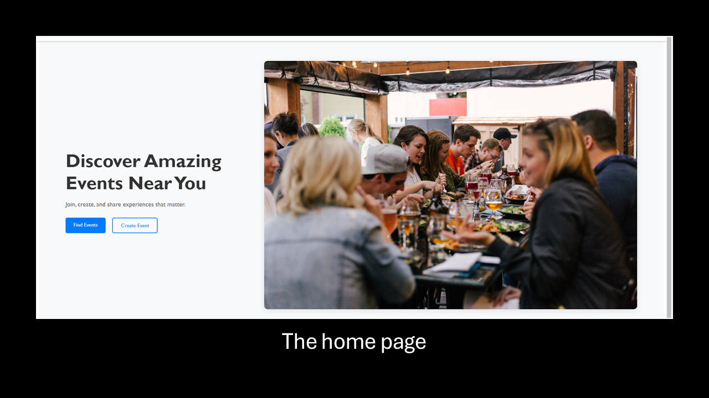
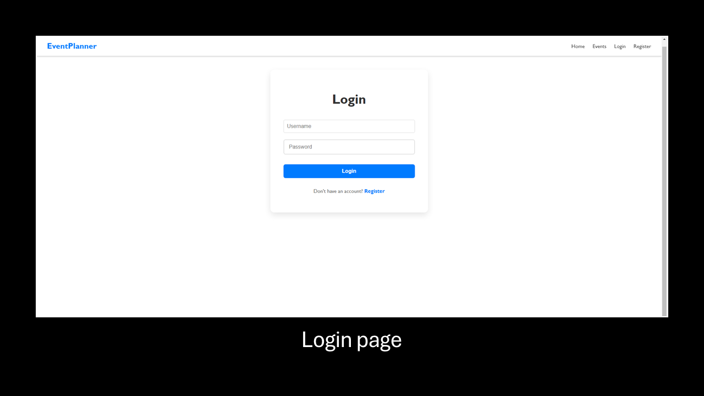
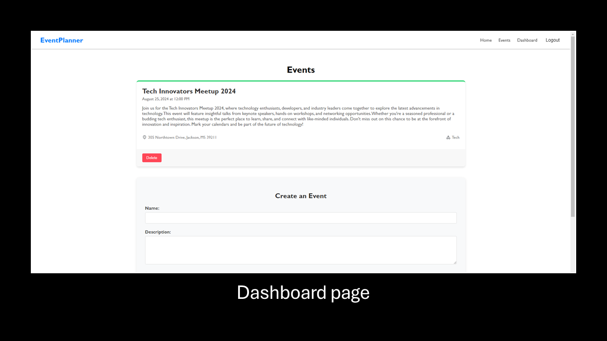
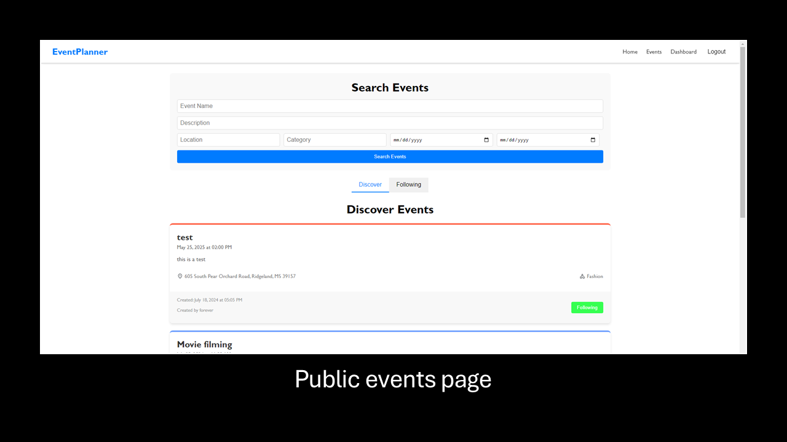
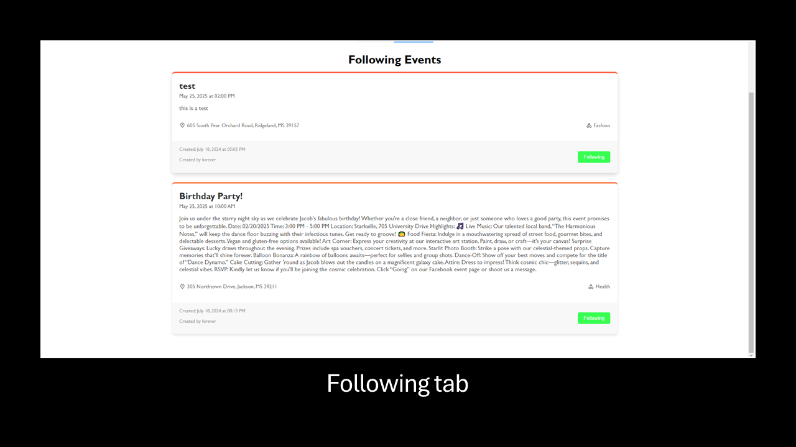

# Event Planner App
Welcome to my project that allows users to create and search for events. This was a project I decided to do to work on experience with React and Django and how to make a proper authentication system. This website was launched on the cloud using Amazon Web Services. The link is available here: [Event Planner App](http://event-planner-web-app.s3-website-us-west-2.amazonaws.com)

## Table of Contents
- [Event Planner App](#event-planner-app)
  - [Table of Contents](#table-of-contents)
  - [Features](#features)
  - [Architecture Overview](#architecture-overview)
  - [Live Demo](#live-demo)
  - [Screenshots](#screenshots)
  - [Technologies Used](#technologies-used)
  - [Usage](#usage)
  - [API Integration](#api-integration)
  - [Deployment](#deployment)
  - [Contact Information](#contact-information)

## Features

- Create events
- Remove events
- Set events public or private
- Set the location of the event
- Set the time of the event
- View other peoples events
- Search for other events
- Follow other users
- Sort by followed users
- Sort by recent posts

## Architecture Overview

    

## Live Demo

The link is available here: http://event-planner-web-app.s3-website-us-west-2.amazonaws.com

## Screenshots

    
    
    
    
    

## Technologies Used

- React.JS
- Django
- Vite.JS
- PostgreSQL
- Amazon Web Services (AWS)
  - Amazon EC2
  - Amazon S3
  - Amazon RDS
  - Amazon VPC

## Usage

You must first create an account before using this service. Once you create an account, you can go to the dashboard page to create and view your own events. You can go to the events page to list all of the publicly available events and follow other users.
<strong>Note: Do not use your real password as I cannot guarantee the safety of your data.</strong>

## API Integration

The backend uses REST API in order to communicate with the frontend. These are the list of APIs in the backend that communicate the database information to the frontend.
1. **GET /api/events/** - This endpoint retrieves the list of the events.
2. **POST /api/events/** - This endpoint allows adding a new event.
3. **GET /api/events/public** - This endpoint lists the public events from other users.
4. **GET /api/users/following** - This endpoint lists the users that this user is following.
5. **GET /api/events/following** - This endpoint retrieves the list of events that have been created by someone the user has followed.
6. **POST /api/token** - This endpoint posts a token for the user to be authenticated.
7. **POST /api/user/register** - This endpoint posts to the database of the user's information.
8. **DELETE /api/events/delete/<event.id>** - This endpoint deletes the event with the specified event id.

In addition to these APIs, the frontend also communicates with an API from Mapbox to add the feature of autofilling address information for choosing the event location. This solution can be found here: https://docs.mapbox.com/mapbox-search-js/guides/ 

## Deployment

Steps for deploying the app on AWS:
- Frontend
  - Create an S3 bucket and set it to be public
  - Enable static website hosting
  - Create static files from react project by using ``npm run build``
  - Put the static files in the S3 bucket
- Backend
  - Create an EC2 instance
  - Edit the security group to allow requests on port 8000
  - SSH into the EC2 instance
  - Download from a repository containing the backend files
  - Use nginx to create an HTTP server and serve your backend
- Database
  - Create a PostgreSQL RDS database in a private subnet
  - Link the EC2 and RDS together using security groups to allow communication between them

## Contact Information
For any questions or issues, please contact:
- Your Name - [ericduncan960@yahoo.com](mailto:ericduncan960@yahoo.com)
- GitHub - [ed843](https://github.com/ed843)